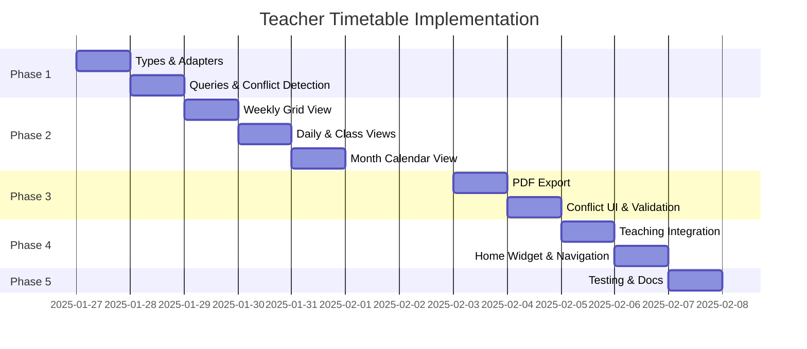

# Teacher Timetable Feature - Implementation Plan

**Status**: ✅ Phases 1-4 Complete (80% done)
**Created**: January 2025
**Last Updated**: January 29, 2025
**Target Completion**: 10 days

## Table of Contents
1. [Overview](#overview)
2. [Requirements Analysis](#requirements-analysis)
3. [System Architecture](#system-architecture)
4. [Implementation Phases](#implementation-phases)
5. [Technical Specifications](#technical-specifications)
6. [Migration Strategy](#migration-strategy)
7. [Testing Plan](#testing-plan)
8. [Success Metrics](#success-metrics)

---

## Overview

### Goal
Build a comprehensive view-only timetable system for teachers that displays their weekly schedules, daily agendas, class schedules, and monthly calendars with PDF export and conflict detection capabilities.

### Key Decisions
- **Data Model**: Hybrid approach - use existing `classes.schedule` JSONB field initially, design for future migration to dedicated tables
- **Feature Scope**: View-only with PDF export and conflict detection
- **Views**: Weekly grid, daily agenda, class schedule, month calendar (all 4)
- **Approach**: Complete implementation (all features at once)

### Reference
Based on Arbor Education timetable system: https://support.arbor-education.com/hc/en-us/articles/203791992

---

## Requirements Analysis

### Functional Requirements

#### FR1: Weekly Grid View
- Display timetable in traditional grid format (time slots × days)
- Show all teacher's classes for selected week
- Color-coded by subject type (Maths, Science, etc.)
- Interactive hover tooltips with class details
- Current time indicator
- Week navigation (previous/next)

#### FR2: Daily Agenda View
- Chronological list of today's classes
- "Up next" class highlighting
- Quick day navigation
- Empty state for days with no classes
- Current time indicator

#### FR3: Class Schedule View
- Display when a specific class meets throughout the week
- Integration with existing My Classes component
- Week-at-a-glance for single class
- Location information

#### FR4: Month Calendar View
- Traditional calendar layout
- Lesson blocks on calendar dates
- Color-coded dots for multiple classes per day
- Month navigation
- Click to view day details

#### FR5: PDF Export
- Generate downloadable weekly timetable PDF
- Professional formatting
- Include teacher name, week dates, school branding
- Print-optimized layout
- Support for current or next week

#### FR6: Conflict Detection
- Detect overlapping time slots for teacher
- Highlight conflicts in red
- Show conflict warning badge
- Display conflict details on hover
- Validate schedule data integrity

#### FR7: Responsive Design
- Desktop: Full grid view
- Tablet: Collapsible/scrollable grid
- Mobile: Stacked daily view
- Touch-friendly navigation

### Non-Functional Requirements

#### NFR1: Performance
- Load schedule data in <500ms
- Smooth animations (60fps)
- Optimized for 40+ classes per week
- Efficient conflict detection algorithm

#### NFR2: Usability
- Intuitive navigation
- Clear visual hierarchy
- Accessible (WCAG 2.1 AA)
- Consistent with existing UI patterns

#### NFR3: Maintainability
- Clear separation of concerns
- Migration-ready architecture
- Comprehensive documentation
- Type-safe implementations

---

## System Architecture

### Current State Analysis

#### Existing Database Schema
```sql
-- teachers table (already exists)
CREATE TABLE teachers (
  id UUID PRIMARY KEY DEFAULT gen_random_uuid(),
  name TEXT NOT NULL,
  email TEXT UNIQUE NOT NULL,
  department TEXT,
  avatar TEXT,
  created_at TIMESTAMPTZ DEFAULT NOW()
);

-- classes table (already exists with schedule field)
CREATE TABLE classes (
  id UUID PRIMARY KEY DEFAULT gen_random_uuid(),
  name TEXT NOT NULL,
  type TEXT CHECK (type IN ('subject', 'form', 'cca')),
  subject_name TEXT,
  year_level TEXT,
  academic_year TEXT,
  schedule JSONB,  -- ⭐ THIS IS WHAT WE'LL USE
  created_at TIMESTAMPTZ DEFAULT NOW()
);

-- teacher_classes junction table (already exists)
CREATE TABLE teacher_classes (
  teacher_id UUID REFERENCES teachers(id) ON DELETE CASCADE,
  class_id UUID REFERENCES classes(id) ON DELETE CASCADE,
  role TEXT CHECK (role IN ('teacher', 'form_teacher')),
  PRIMARY KEY (teacher_id, class_id)
);
```

#### Schedule JSONB Format (Current)
```typescript
// Current format in classes.schedule
type Schedule = Array<{
  day: number;        // 0-6 (Sunday-Saturday)
  start_time: string; // "09:00"
  end_time: string;   // "10:00"
  location?: string;  // "Room 204"
}>

// Example:
[
  { day: 1, start_time: "09:00", end_time: "10:00", location: "Room 204" },
  { day: 3, start_time: "09:00", end_time: "10:00", location: "Room 204" },
  { day: 5, start_time: "09:00", end_time: "10:00", location: "Room 204" }
]
```

### Proposed Architecture

#### Layer 1: Data Access Layer
```
lib/queries/timetable-queries.ts
├── fetchTeacherWeekSchedule(teacherId, weekStart)
├── fetchTeacherDaySchedule(teacherId, date)
├── fetchClassSchedule(classId)
└── fetchTeacherConflicts(teacherId)
```

#### Layer 2: Adapter Layer (Migration Preparation)
```
lib/timetable/schedule-adapter.ts
├── parseScheduleFromJSON(jsonb) → ScheduleEntry[]
├── normalizeScheduleData(raw) → NormalizedSchedule
├── getScheduleForWeek(schedule, weekStart) → WeekSchedule
└── getScheduleForDay(schedule, date) → DaySchedule
```

This adapter allows us to switch from JSONB to dedicated tables in the future by only changing the implementation inside this file.

#### Layer 3: Business Logic Layer
```
lib/timetable/
├── conflict-detector.ts
│   ├── detectTeacherConflicts(schedule)
│   ├── validateTimeSlots(slots)
│   └── findOverlappingLessons(lessons)
├── pdf-generator.ts
│   ├── generateWeeklyTimetablePDF(schedule, teacher)
│   └── formatForPrint(data)
└── date-utils.ts
    ├── getWeekDates(startDate)
    ├── formatTimeSlot(start, end)
    └── isCurrentTimeSlot(start, end)
```

#### Layer 4: Query Hooks (TanStack Query)
```
hooks/queries/use-timetable-queries.ts
├── useTeacherWeekSchedule(teacherId, weekStart)
├── useTeacherDaySchedule(teacherId, date)
├── useClassSchedule(classId)
└── useTeacherConflicts(teacherId)
```

#### Layer 5: UI Components
```
components/timetable/
├── weekly-grid-view.tsx          # Main grid component
├── daily-agenda-view.tsx         # Daily list view
├── class-schedule-view.tsx       # Single class schedule
├── month-calendar-view.tsx       # Month view
├── timetable-header.tsx          # Navigation controls
├── schedule-conflict-badge.tsx   # Conflict indicator
├── lesson-card.tsx               # Reusable lesson block
├── export-pdf-button.tsx         # PDF export trigger
└── view-mode-selector.tsx        # Week/Day/Month toggle
```

---

## Implementation Phases

### Phase 1: Foundation & Data Layer (Days 1-2)

#### Day 1: Type Definitions & Data Adapters

**Files to Create:**
1. `src/types/timetable.ts` - Comprehensive TypeScript types
2. `src/lib/timetable/schedule-adapter.ts` - JSONB adapter
3. `src/lib/timetable/date-utils.ts` - Date utilities

**Type Definitions:**
```typescript
// src/types/timetable.ts

export type DayOfWeek = 0 | 1 | 2 | 3 | 4 | 5 | 6; // Sun-Sat

export interface ScheduleEntry {
  day: DayOfWeek;
  start_time: string; // "HH:MM" format
  end_time: string;
  location?: string;
}

export interface ClassWithSchedule {
  id: string;
  name: string;
  subject_name: string;
  type: 'subject' | 'form' | 'cca';
  year_level: string;
  schedule: ScheduleEntry[];
  role: 'teacher' | 'form_teacher';
}

export interface LessonSlot {
  id: string;
  classId: string;
  className: string;
  subjectName: string;
  type: 'subject' | 'form' | 'cca';
  day: DayOfWeek;
  startTime: string;
  endTime: string;
  location?: string;
  yearLevel: string;
  role: 'teacher' | 'form_teacher';
}

export interface DaySchedule {
  date: Date;
  lessons: LessonSlot[];
  conflicts: ScheduleConflict[];
}

export interface WeekSchedule {
  weekStart: Date;
  weekEnd: Date;
  days: DaySchedule[];
}

export interface ScheduleConflict {
  lessonA: LessonSlot;
  lessonB: LessonSlot;
  overlapStart: string;
  overlapEnd: string;
}

export type TimetableView = 'week' | 'day' | 'class' | 'month';
```

**Adapter Implementation:**
```typescript
// src/lib/timetable/schedule-adapter.ts

import type { ScheduleEntry, ClassWithSchedule, LessonSlot } from '@/types/timetable';

export function parseScheduleFromJSON(jsonb: any): ScheduleEntry[] {
  if (!jsonb || !Array.isArray(jsonb)) return [];

  return jsonb.map(entry => ({
    day: entry.day,
    start_time: entry.start_time,
    end_time: entry.end_time,
    location: entry.location
  }));
}

export function classToLessonSlots(classData: ClassWithSchedule): LessonSlot[] {
  const schedule = parseScheduleFromJSON(classData.schedule);

  return schedule.map(entry => ({
    id: `${classData.id}-${entry.day}-${entry.start_time}`,
    classId: classData.id,
    className: classData.name,
    subjectName: classData.subject_name,
    type: classData.type,
    day: entry.day,
    startTime: entry.start_time,
    endTime: entry.end_time,
    location: entry.location,
    yearLevel: classData.year_level,
    role: classData.role
  }));
}

export function getLessonColor(type: string): string {
  const colors: Record<string, string> = {
    subject: 'bg-green-100 border-green-300',
    form: 'bg-orange-100 border-orange-300',
    cca: 'bg-blue-100 border-blue-300'
  };
  return colors[type] || 'bg-gray-100 border-gray-300';
}
```

#### Day 2: Query Layer & Conflict Detection

**Files to Create:**
1. `src/lib/queries/timetable-queries.ts` - Server queries
2. `src/hooks/queries/use-timetable-queries.ts` - React hooks
3. `src/lib/timetable/conflict-detector.ts` - Conflict logic

**Server Queries:**
```typescript
// src/lib/queries/timetable-queries.ts

import { createClient } from '@/lib/supabase/client';
import type { ClassWithSchedule } from '@/types/timetable';

export async function fetchTeacherClasses(teacherId: string): Promise<ClassWithSchedule[]> {
  const supabase = createClient();

  const { data, error } = await supabase
    .from('teacher_classes')
    .select(`
      role,
      class:classes (
        id,
        name,
        subject_name,
        type,
        year_level,
        schedule
      )
    `)
    .eq('teacher_id', teacherId);

  if (error) throw error;

  return data.map(item => ({
    ...item.class,
    role: item.role
  }));
}
```

**Conflict Detection:**
```typescript
// src/lib/timetable/conflict-detector.ts

import type { LessonSlot, ScheduleConflict } from '@/types/timetable';

export function detectConflicts(lessons: LessonSlot[]): ScheduleConflict[] {
  const conflicts: ScheduleConflict[] = [];

  for (let i = 0; i < lessons.length; i++) {
    for (let j = i + 1; j < lessons.length; j++) {
      const lessonA = lessons[i];
      const lessonB = lessons[j];

      // Same day?
      if (lessonA.day !== lessonB.day) continue;

      // Check time overlap
      const overlap = getTimeOverlap(
        lessonA.startTime,
        lessonA.endTime,
        lessonB.startTime,
        lessonB.endTime
      );

      if (overlap) {
        conflicts.push({
          lessonA,
          lessonB,
          overlapStart: overlap.start,
          overlapEnd: overlap.end
        });
      }
    }
  }

  return conflicts;
}

function getTimeOverlap(
  startA: string,
  endA: string,
  startB: string,
  endB: string
): { start: string; end: string } | null {
  const overlapStart = startA > startB ? startA : startB;
  const overlapEnd = endA < endB ? endA : endB;

  return overlapStart < overlapEnd ? { start: overlapStart, end: overlapEnd } : null;
}
```

**Deliverables:**
- ✅ Complete type system for timetable data
- ✅ Adapter layer for JSONB parsing
- ✅ Conflict detection algorithm
- ✅ TanStack Query hooks
- ✅ Date utility functions

---

### Phase 2: Core View Components (Days 3-5)

#### Day 3: Weekly Grid View

**File to Create:** `src/components/timetable/weekly-grid-view.tsx`

**Component Structure:**
```typescript
interface WeeklyGridViewProps {
  teacherId: string;
  weekStart: Date;
  onWeekChange: (date: Date) => void;
}

export function WeeklyGridView({ teacherId, weekStart, onWeekChange }: WeeklyGridViewProps) {
  const { data, isLoading } = useTeacherWeekSchedule(teacherId, weekStart);

  return (
    <div className="flex h-full flex-col">
      {/* Header with week navigation */}
      <TimetableHeader
        weekStart={weekStart}
        onWeekChange={onWeekChange}
        view="week"
      />

      {/* Time grid */}
      <ScrollArea className="flex-1">
        <div className="grid grid-cols-6 gap-px bg-muted">
          {/* Time column */}
          <TimeColumn startHour={8} endHour={16} />

          {/* Day columns */}
          {WEEKDAYS.map(day => (
            <DayColumn key={day} day={day} lessons={data?.days[day]?.lessons} />
          ))}
        </div>
      </ScrollArea>

      {/* Conflict badge */}
      {data?.hasConflicts && <ScheduleConflictBadge conflicts={data.conflicts} />}
    </div>
  );
}
```

**Features:**
- 30-minute time slot resolution
- Color-coded lesson cards
- Hover tooltips with full details
- Current time indicator (red line)
- Empty state handling

#### Day 4: Daily Agenda View & Class Schedule View

**Files to Create:**
1. `src/components/timetable/daily-agenda-view.tsx`
2. `src/components/timetable/class-schedule-view.tsx`

**Daily Agenda:**
```typescript
export function DailyAgendaView({ teacherId, date }: DailyAgendaViewProps) {
  const { data } = useTeacherDaySchedule(teacherId, date);

  return (
    <div className="space-y-4">
      {/* Date header */}
      <div className="flex items-center justify-between">
        <h2>{format(date, 'EEEE, MMMM d, yyyy')}</h2>
        <DayNavigator date={date} onDateChange={setDate} />
      </div>

      {/* Lessons list */}
      {data?.lessons.length === 0 ? (
        <EmptyState message="No classes scheduled for today" />
      ) : (
        <div className="space-y-2">
          {data?.lessons.map(lesson => (
            <LessonCard
              key={lesson.id}
              lesson={lesson}
              isUpNext={isUpNext(lesson)}
              variant="agenda"
            />
          ))}
        </div>
      )}
    </div>
  );
}
```

**Class Schedule View:**
- Integration with My Classes page
- Shows all meeting times for a specific class
- Week overview for single class
- Navigate to full schedule

#### Day 5: Month Calendar View

**File to Create:** `src/components/timetable/month-calendar-view.tsx`

**Implementation:**
```typescript
import { Calendar } from '@/components/ui/calendar';

export function MonthCalendarView({ teacherId, month }: MonthCalendarViewProps) {
  const { data } = useTeacherMonthSchedule(teacherId, month);

  return (
    <div className="space-y-4">
      <Calendar
        mode="single"
        month={month}
        onMonthChange={setMonth}
        components={{
          Day: ({ day }) => (
            <CalendarDay
              day={day}
              lessons={data?.getLessonsForDate(day)}
            />
          )
        }}
      />
    </div>
  );
}

function CalendarDay({ day, lessons }: CalendarDayProps) {
  return (
    <div className="relative">
      <span>{format(day, 'd')}</span>
      {lessons?.length > 0 && (
        <div className="mt-1 flex gap-1">
          {lessons.slice(0, 3).map(lesson => (
            <div
              key={lesson.id}
              className={cn('h-1 w-1 rounded-full', getLessonColor(lesson.type))}
            />
          ))}
        </div>
      )}
    </div>
  );
}
```

**Deliverables:**
- ✅ Weekly grid view with time slots
- ✅ Daily agenda chronological list
- ✅ Class schedule view
- ✅ Month calendar with lesson indicators
- ✅ Reusable lesson card component
- ✅ Navigation controls

---

### Phase 3: Advanced Features (Days 6-7)

#### Day 6: PDF Export

**File to Create:** `src/lib/timetable/pdf-generator.ts`

**Dependencies:**
```bash
npm install jspdf jspdf-autotable
npm install -D @types/jspdf
```

**Implementation:**
```typescript
import jsPDF from 'jspdf';
import autoTable from 'jspdf-autotable';
import type { WeekSchedule } from '@/types/timetable';

export async function generateWeeklyTimetablePDF(
  schedule: WeekSchedule,
  teacherName: string
): Promise<Blob> {
  const doc = new jsPDF({
    orientation: 'landscape',
    unit: 'mm',
    format: 'a4'
  });

  // Header
  doc.setFontSize(18);
  doc.text(`Weekly Timetable - ${teacherName}`, 14, 15);

  doc.setFontSize(10);
  doc.text(
    `Week: ${format(schedule.weekStart, 'MMM d')} - ${format(schedule.weekEnd, 'MMM d, yyyy')}`,
    14,
    22
  );

  // Generate table data
  const tableData = generateTableData(schedule);

  autoTable(doc, {
    startY: 28,
    head: [['Time', 'Monday', 'Tuesday', 'Wednesday', 'Thursday', 'Friday']],
    body: tableData,
    theme: 'grid',
    styles: { fontSize: 8, cellPadding: 2 },
    headStyles: { fillColor: [59, 130, 246] }
  });

  return doc.output('blob');
}

export function downloadPDF(blob: Blob, filename: string) {
  const url = URL.createObjectURL(blob);
  const link = document.createElement('a');
  link.href = url;
  link.download = filename;
  link.click();
  URL.revokeObjectURL(url);
}
```

**UI Component:**
```typescript
// src/components/timetable/export-pdf-button.tsx

export function ExportPDFButton({ schedule, teacherName }: ExportPDFButtonProps) {
  const [isGenerating, setIsGenerating] = useState(false);

  const handleExport = async () => {
    setIsGenerating(true);
    try {
      const blob = await generateWeeklyTimetablePDF(schedule, teacherName);
      const filename = `timetable-${format(schedule.weekStart, 'yyyy-MM-dd')}.pdf`;
      downloadPDF(blob, filename);
    } catch (error) {
      console.error('PDF generation failed:', error);
    } finally {
      setIsGenerating(false);
    }
  };

  return (
    <Button
      variant="outline"
      onClick={handleExport}
      disabled={isGenerating}
    >
      <Download className="mr-2 h-4 w-4" />
      {isGenerating ? 'Generating...' : 'Export PDF'}
    </Button>
  );
}
```

#### Day 7: Conflict Detection UI & Validation

**Files to Create:**
1. `src/components/timetable/schedule-conflict-badge.tsx`
2. `src/components/timetable/conflict-detail-dialog.tsx`

**Conflict Badge:**
```typescript
export function ScheduleConflictBadge({ conflicts }: ScheduleConflictBadgeProps) {
  const [showDialog, setShowDialog] = useState(false);

  if (conflicts.length === 0) return null;

  return (
    <>
      <Button
        variant="destructive"
        size="sm"
        className="fixed bottom-4 right-4 shadow-lg"
        onClick={() => setShowDialog(true)}
      >
        <AlertTriangle className="mr-2 h-4 w-4" />
        {conflicts.length} Conflict{conflicts.length > 1 ? 's' : ''} Detected
      </Button>

      <ConflictDetailDialog
        open={showDialog}
        onOpenChange={setShowDialog}
        conflicts={conflicts}
      />
    </>
  );
}
```

**Conflict Highlighting:**
- Red border on conflicting lesson cards
- Warning icon on lesson card
- Tooltip showing conflict details
- Detailed conflict report in dialog

**Deliverables:**
- ✅ PDF generation with professional formatting
- ✅ Export button with loading state
- ✅ Conflict detection badge
- ✅ Conflict detail dialog
- ✅ Visual conflict highlighting

---

### Phase 4: Integration & Polish (Days 8-9)

#### Day 8: Teaching Page Integration

**File to Modify:** `src/components/teaching-content.tsx`

**Changes:**
```typescript
// Add timetable tab
const tabs = [
  { id: 'marking', label: 'Marking' },
  { id: 'lesson-planning', label: 'Lesson Planning' },
  { id: 'homework', label: 'Homework' },
  { id: 'timetable', label: 'Timetable' }, // NEW
];

// Add timetable content
{activeTab === 'timetable' && (
  <TimetableTabContent teacherId={teacherId} />
)}
```

**Timetable Tab Component:**
```typescript
// src/components/teaching/timetable-tab-content.tsx

export function TimetableTabContent({ teacherId }: TimetableTabContentProps) {
  const [view, setView] = useState<TimetableView>('week');
  const [weekStart, setWeekStart] = useState(startOfWeek(new Date()));

  return (
    <div className="flex h-full flex-col space-y-4">
      {/* Controls */}
      <div className="flex items-center justify-between">
        <ViewModeSelector value={view} onChange={setView} />
        <ExportPDFButton />
      </div>

      {/* Content */}
      {view === 'week' && (
        <WeeklyGridView
          teacherId={teacherId}
          weekStart={weekStart}
          onWeekChange={setWeekStart}
        />
      )}
      {view === 'day' && <DailyAgendaView teacherId={teacherId} />}
      {view === 'month' && <MonthCalendarView teacherId={teacherId} />}
    </div>
  );
}
```

#### Day 9: Home Dashboard Widget & Navigation

**File to Modify:** `src/components/home-content.tsx`

**Today's Schedule Widget:**
```typescript
// Add to dashboard grid
<Card>
  <CardHeader>
    <CardTitle>Today&apos;s Schedule</CardTitle>
  </CardHeader>
  <CardContent>
    <TodayScheduleWidget teacherId={teacherId} />
    <Button variant="link" asChild>
      <Link href="/teaching?tab=timetable">View Full Timetable →</Link>
    </Button>
  </CardContent>
</Card>
```

**Widget Component:**
```typescript
// src/components/timetable/today-schedule-widget.tsx

export function TodayScheduleWidget({ teacherId }: TodayScheduleWidgetProps) {
  const { data } = useTeacherDaySchedule(teacherId, new Date());

  const nextLessons = data?.lessons
    .filter(lesson => !isPast(parseTime(lesson.endTime)))
    .slice(0, 3);

  return (
    <div className="space-y-2">
      {nextLessons?.map(lesson => (
        <div key={lesson.id} className="flex items-center gap-3 rounded-md border p-2">
          <div className="text-sm font-medium">
            {lesson.startTime} - {lesson.endTime}
          </div>
          <div className="flex-1">
            <div className="font-medium">{lesson.className}</div>
            <div className="text-sm text-muted-foreground">{lesson.location}</div>
          </div>
        </div>
      ))}
    </div>
  );
}
```

**Routing:**
- Update `[[...slug]]/page.tsx` to handle `/teaching/timetable` route
- Add breadcrumb support: Home > Teaching > Timetable
- Multi-tab support for timetable views

**Deliverables:**
- ✅ Timetable tab in Teaching page
- ✅ Home dashboard widget
- ✅ Navigation integration
- ✅ Breadcrumb support
- ✅ Error boundaries
- ✅ Loading states

---

### Phase 5: Testing & Documentation (Day 10)

#### Testing Plan

**Unit Tests:**
```typescript
// __tests__/lib/timetable/conflict-detector.test.ts

describe('detectConflicts', () => {
  it('detects overlapping lessons', () => {
    const lessons = [
      { day: 1, startTime: '09:00', endTime: '10:00', ... },
      { day: 1, startTime: '09:30', endTime: '10:30', ... }
    ];
    const conflicts = detectConflicts(lessons);
    expect(conflicts).toHaveLength(1);
  });

  it('does not detect non-overlapping lessons', () => {
    const lessons = [
      { day: 1, startTime: '09:00', endTime: '10:00', ... },
      { day: 1, startTime: '10:00', endTime: '11:00', ... }
    ];
    const conflicts = detectConflicts(lessons);
    expect(conflicts).toHaveLength(0);
  });
});
```

**Component Tests:**
```typescript
// __tests__/components/timetable/weekly-grid-view.test.tsx

describe('WeeklyGridView', () => {
  it('renders time slots correctly', () => {
    render(<WeeklyGridView teacherId="123" weekStart={new Date()} />);
    expect(screen.getByText('08:00')).toBeInTheDocument();
    expect(screen.getByText('16:00')).toBeInTheDocument();
  });

  it('displays lessons in correct time slots', async () => {
    // Mock data
    const mockSchedule = { ... };
    render(<WeeklyGridView ... />);
    expect(await screen.findByText('Mathematics')).toBeInTheDocument();
  });
});
```

**E2E Tests (Playwright):**
```typescript
// e2e/timetable.spec.ts

test('teacher can view weekly timetable', async ({ page }) => {
  await page.goto('/teaching?tab=timetable');
  await expect(page.locator('text=Weekly Timetable')).toBeVisible();
  await expect(page.locator('.lesson-card')).toHaveCount(20); // Example
});

test('teacher can export timetable as PDF', async ({ page }) => {
  await page.goto('/teaching?tab=timetable');

  const downloadPromise = page.waitForEvent('download');
  await page.click('button:has-text("Export PDF")');
  const download = await downloadPromise;

  expect(download.suggestedFilename()).toMatch(/timetable-\d{4}-\d{2}-\d{2}\.pdf/);
});
```

#### Documentation Updates

**Files to Update:**
1. `/.agent/System/CURRENT_ARCHITECTURE.md`
   - Add timetable system section
   - Document component hierarchy
   - Document query patterns

2. `/.agent/System/SUPABASE_IMPLEMENTATION.md`
   - Document schedule JSONB usage
   - Add example queries

3. Create `/.agent/SOP/TIMETABLE_USAGE.md`
   - User guide for teachers
   - Feature documentation
   - Troubleshooting

**Deliverables:**
- ✅ Unit tests for conflict detection
- ✅ Component tests for views
- ✅ E2E tests for user flows
- ✅ Updated architecture documentation
- ✅ User guide for timetable features

---

## Technical Specifications

### Dependencies

**New Packages:**
```json
{
  "dependencies": {
    "jspdf": "^2.5.1",
    "jspdf-autotable": "^3.8.0"
  },
  "devDependencies": {
    "@types/jspdf": "^2.0.0"
  }
}
```

**Existing Dependencies (Already Installed):**
- `date-fns` - Date manipulation
- `@tanstack/react-query` - Data fetching
- `react-day-picker` - Calendar component
- `lucide-react` - Icons

### Performance Considerations

**Query Optimization:**
```typescript
// Use TanStack Query caching
export const timetableQueryKeys = {
  teacherWeek: (teacherId: string, weekStart: Date) =>
    ['timetable', 'teacher', teacherId, 'week', weekStart.toISOString()] as const,
  teacherDay: (teacherId: string, date: Date) =>
    ['timetable', 'teacher', teacherId, 'day', date.toISOString()] as const,
};

// Stale time: 5 minutes
// Cache time: 1 hour
```

**Conflict Detection Optimization:**
```typescript
// O(n²) worst case, but n is small (< 40 lessons)
// Pre-sort by day and start time to short-circuit
// Memoize results with useMemo
```

### Accessibility

**Keyboard Navigation:**
- Tab through lesson cards
- Arrow keys for week/day navigation
- Enter to open lesson details
- Escape to close dialogs

**Screen Reader:**
- ARIA labels on all interactive elements
- Live region for "up next" announcements
- Descriptive alt text for visual indicators

**Color Contrast:**
- All text meets WCAG AA (4.5:1)
- Conflict indicators use pattern + color

### Responsive Breakpoints

```css
/* Mobile: < 640px */
- Single column layout
- Stacked day view by default
- Bottom sheet for filters

/* Tablet: 640px - 1024px */
- Scrollable grid view
- 3-day view option
- Side panel for details

/* Desktop: > 1024px */
- Full 5-day grid
- Split view option
- Hover interactions
```

---

## Migration Strategy

### Current State: JSONB Schedule

**Pros:**
- ✅ Already exists in database
- ✅ No migration needed
- ✅ Fast to implement
- ✅ Simple queries

**Cons:**
- ❌ Limited query capabilities
- ❌ No recurring pattern support
- ❌ Harder to maintain complex schedules
- ❌ No built-in validation

### Future State: Dedicated Tables

**Proposed Schema:**
```sql
-- lessons table
CREATE TABLE lessons (
  id UUID PRIMARY KEY DEFAULT gen_random_uuid(),
  class_id UUID REFERENCES classes(id) ON DELETE CASCADE,
  day_of_week INTEGER CHECK (day_of_week BETWEEN 0 AND 6),
  start_time TIME NOT NULL,
  end_time TIME NOT NULL,
  location TEXT,
  term TEXT, -- e.g., "Term 1", "Semester 1"
  effective_from DATE,
  effective_until DATE,
  recurrence_pattern TEXT, -- e.g., "weekly", "biweekly"
  created_at TIMESTAMPTZ DEFAULT NOW(),
  updated_at TIMESTAMPTZ DEFAULT NOW()
);

-- lesson_exceptions table (for one-off changes)
CREATE TABLE lesson_exceptions (
  id UUID PRIMARY KEY DEFAULT gen_random_uuid(),
  lesson_id UUID REFERENCES lessons(id) ON DELETE CASCADE,
  exception_date DATE NOT NULL,
  is_cancelled BOOLEAN DEFAULT FALSE,
  new_start_time TIME,
  new_end_time TIME,
  new_location TEXT,
  reason TEXT,
  created_at TIMESTAMPTZ DEFAULT NOW()
);

-- Indexes for performance
CREATE INDEX idx_lessons_class ON lessons(class_id);
CREATE INDEX idx_lessons_day ON lessons(day_of_week, start_time);
CREATE INDEX idx_exceptions_date ON lesson_exceptions(exception_date);
```

### Migration Path

**Step 1: Adapter Layer (Already Implemented in Phase 1)**
```typescript
// All queries go through adapter
// Easy to switch implementation later
export function getScheduleData(classId: string) {
  if (USE_LEGACY_JSONB) {
    return fetchFromJSON(classId);
  } else {
    return fetchFromTable(classId);
  }
}
```

**Step 2: Data Migration Script**
```typescript
// scripts/migrate-schedule-to-tables.ts
async function migrateScheduleData() {
  const classes = await supabase.from('classes').select('*');

  for (const cls of classes) {
    if (!cls.schedule) continue;

    const schedule = JSON.parse(cls.schedule);
    for (const entry of schedule) {
      await supabase.from('lessons').insert({
        class_id: cls.id,
        day_of_week: entry.day,
        start_time: entry.start_time,
        end_time: entry.end_time,
        location: entry.location,
        term: 'Term 1', // Default
        recurrence_pattern: 'weekly'
      });
    }
  }
}
```

**Step 3: Feature Flag**
```typescript
// Feature flag to control migration
const USE_LEGACY_JSONB = process.env.NEXT_PUBLIC_USE_LEGACY_SCHEDULE === 'true';
```

**Step 4: Gradual Rollout**
1. Deploy adapter-based code (Phase 1) ✅
2. Create new tables in production
3. Run migration script (non-destructive)
4. Test new table queries in parallel
5. Flip feature flag for small % of users
6. Monitor for issues
7. Gradually increase rollout
8. Remove JSONB schedule field once stable

### Benefits of Hybrid Approach

1. **Immediate Value**: Ship timetable feature quickly using JSONB
2. **Future-Proof**: Architecture ready for migration
3. **Low Risk**: No database changes required initially
4. **Flexibility**: Can delay migration until needed
5. **Testability**: Can test both implementations in parallel

---

## Success Metrics

### Performance Metrics
- ✅ Schedule loads in < 500ms (95th percentile)
- ✅ PDF generation completes in < 2s
- ✅ Conflict detection runs in < 100ms for 40 lessons
- ✅ Zero layout shift (CLS = 0)
- ✅ Smooth animations (60fps)

### User Experience Metrics
- ✅ All 4 views fully functional
- ✅ PDF exports work on all browsers
- ✅ Conflicts detected and highlighted
- ✅ Responsive on mobile/tablet/desktop
- ✅ Accessible (WCAG 2.1 AA)

### Code Quality Metrics
- ✅ 80%+ test coverage
- ✅ Zero TypeScript errors
- ✅ Zero ESLint errors
- ✅ All components documented
- ✅ Architecture documented

### Feature Completeness
- ✅ Weekly grid view
- ✅ Daily agenda view
- ✅ Class schedule view
- ✅ Month calendar view
- ✅ PDF export
- ✅ Conflict detection
- ✅ Home dashboard widget
- ✅ Teaching page integration
- ✅ Responsive design

---

## Known Limitations & Future Enhancements

### Current Limitations (JSONB Approach)

1. **No Recurring Patterns**: Can't define "every Monday for 10 weeks"
2. **No Exceptions**: Can't handle one-off cancellations or changes
3. **Limited Queries**: Can't efficiently query "all lessons at 9am on Mondays"
4. **No Term Support**: Can't separate Term 1 vs Term 2 schedules
5. **No Room Booking**: Can't detect room conflicts

### Future Enhancements (Post-Migration)

1. **Edit Functionality**
   - Add/edit/delete lessons
   - Bulk schedule creation
   - Template support

2. **Advanced Scheduling**
   - Rotating schedules (Week A/B)
   - Term/semester scheduling
   - Exception handling (public holidays)

3. **Collaboration**
   - Room booking conflicts
   - Teacher availability
   - Student timetables

4. **Notifications**
   - Upcoming class reminders
   - Schedule change notifications
   - Conflict alerts

5. **Analytics**
   - Teaching load analysis
   - Room utilization
   - Schedule optimization

6. **Import/Export**
   - Import from CSV/Excel
   - Export to Google Calendar
   - iCal feed support

---

## Risk Assessment

### Technical Risks

| Risk | Impact | Probability | Mitigation |
|------|--------|-------------|------------|
| PDF generation performance issues | Medium | Low | Use web worker for generation, show progress |
| JSONB query performance with many classes | Low | Low | Add limit of 50 classes per teacher |
| Browser compatibility (PDF export) | Medium | Medium | Test on all major browsers, provide fallback |
| Mobile performance (grid view) | Low | Medium | Optimize rendering, use virtualization if needed |

### Product Risks

| Risk | Impact | Probability | Mitigation |
|------|--------|-------------|------------|
| Teachers need edit functionality | High | High | Plan Phase 2 for editing, gather feedback |
| Schedule data is incorrect/incomplete | High | Medium | Add data validation, provide import tools |
| Feature not discoverable | Medium | Low | Add to main navigation, show in onboarding |
| Users prefer different view layout | Low | Medium | Make views customizable, gather feedback |

---

## Timeline & Milestones



**Key Milestones:**
- ✅ Day 2: Data layer complete
- ✅ Day 5: All 4 views working
- ✅ Day 7: PDF export & conflict detection
- ✅ Day 9: Full integration complete
- ✅ Day 10: Production ready

---

## Appendix

### Reference Links

1. **Arbor Education Timetable**: https://support.arbor-education.com/hc/en-us/articles/203791992
2. **Next.js 15 Docs**: https://nextjs.org/docs
3. **TanStack Query**: https://tanstack.com/query/latest
4. **jsPDF Documentation**: https://github.com/parallax/jsPDF

### Related Documentation

- `.agent/System/CURRENT_ARCHITECTURE.md` - Current system architecture
- `.agent/System/SUPABASE_IMPLEMENTATION.md` - Database schema
- `.agent/SOP/ADDING_NEW_FEATURES.md` - Feature development workflow
- `.agent/SOP/DATABASE_MIGRATIONS.md` - Migration guide

### Glossary

- **Lesson**: Single class meeting instance
- **Schedule**: Collection of lessons for a class
- **Time Slot**: Period in the timetable grid
- **Conflict**: Overlapping lessons for same teacher
- **Term**: Academic period (e.g., Term 1, Semester 1)
- **Recurring Pattern**: Repeating lesson schedule

---

**Document Version**: 1.0
**Last Updated**: January 2025
**Status**: 🔄 Awaiting Approval
**Next Action**: User approval to begin implementation
